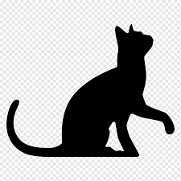

<!--HEADINGS(RÚBRICAS)-->

# Mi título
## MY title 2
### Mi titulo 3
#### MI titulo 4
##### MI titulo 5
###### MI titulo 6

<!--italic-->
This is an *italic* text

<!--negrita-->
this is an **strong** text

<!--tachado-->
este es un ~~texto~~ tachado

<!--Listas desordenadas-->
* Apple
    * red
* Orange

<!--Listas ordenadas-->
1. Apple
    1. Apple red
2. Orange

[faztweb.com](https://ww.faztweb.com)

[faztweb.com](https://ww.faztweb.com "Hello")

>  this is a quote

---
____


<!--Colocar una línea de código-->
`console.log('hello world')`


<!--Colocar un bloque de código-->

```Python

print('Hola Mundo')

def suma(x, y):
    z = x + y
    return z

```


```html
<h1>helloworld</h1>

```
<!--Crear tabla-->

| Tables | Are   | Cool  |
|--------|:-----:|------:|
| col 3  |   1   | $600  | 
| col 4  |   2   | $70   | 
| col5   |   3   | $90   |

<!--Añadir imagen con link-->


<!--Añadir imagen desde el pc-->



<!--Github Markdown-->

* [x] Task 1
* [] Task 2
* [] Task 3
* [] Task 4
